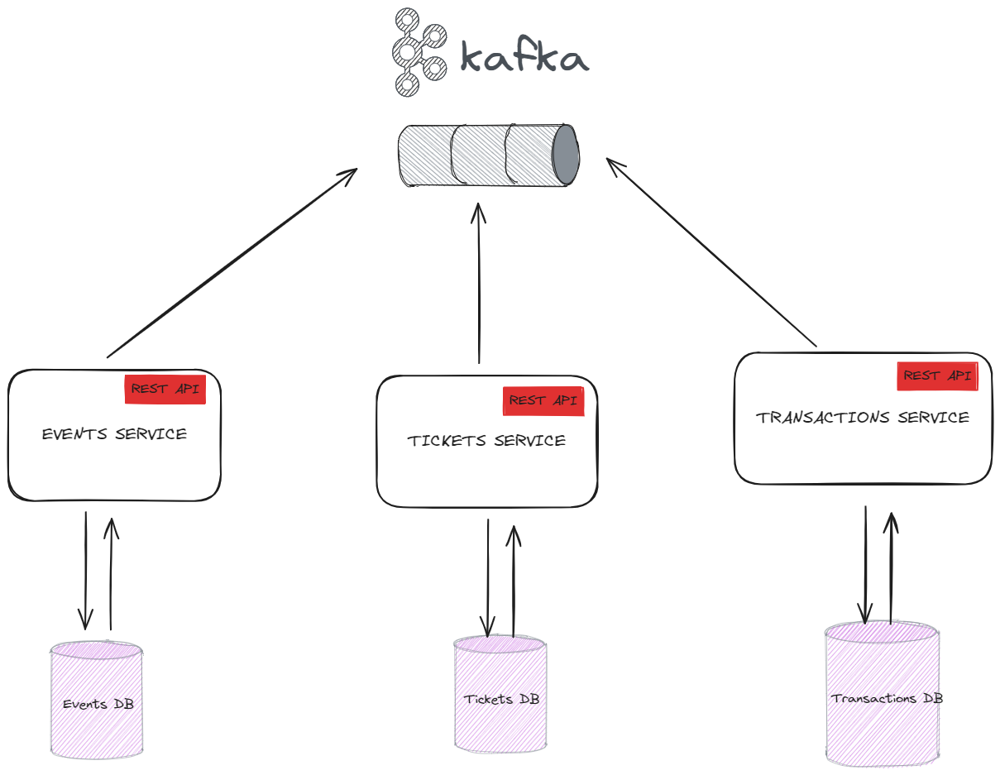
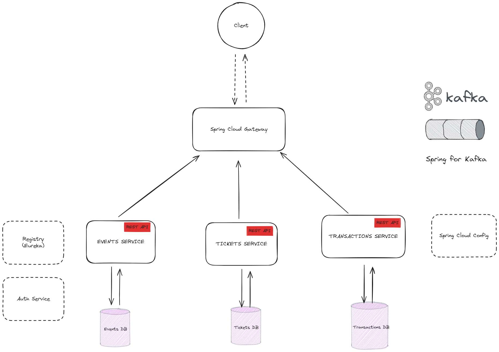
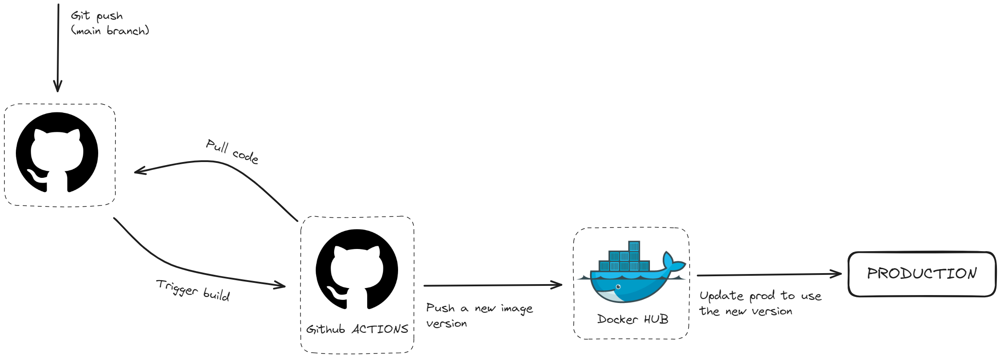

# Java microservices booking app
The is a simple booking app built to demonstrate the [Microservice architecture](https://martinfowler.com/microservices/) using the Spring Boot, Spring Cloud and Docker. The project is intended as a tutorial. 

## Functionnal services 
The app is decomposed into three core microservices. There are independently deployable applications organizaed around a certain business domains.

They communicate with each other asynchronously through Kafka, each service subscribes to the topics they have to and handles events when they are published.



### Events service
Exposes endpoints to handle events CRUD.

Method	| Path	| Description	| User authenticated	| 
------------- | ------------------------- | ------------- |:-------------:|
GET	| /events	| Get all the events	|  | 	
GET	| /events/{id}	| Get a specific event	| × | ×
POST	| /events	| Create a new event	|   | 	×
PUT	| /events/{id}	| Update a given event	| × | ×
DELETE	| /events/{id}	| Cancel a given event	| × | ×

### Tickets service
Exposes endpoints to create the different types of Tickets available for a event and track the tickets still available or sold. 

Method	| Path	| Description	| User authenticated	| 
------------- | ------------------------- | ------------- |:-------------:|
GET	| /tickets?eventId	| Get all the ticket for an event	|  | 	
POST	| /tickets	| Create ticket type for an event	|   | 	×
PUT	| /tickets/{id}	| Update a given ticket	| × | ×
DELETE	| /tickets/{id}	| Remove a ticket type	| × | ×

### Transactions service
Exposes endpoints to buy a ticket, cancel a purchase, etc. 

Method	| Path	| Description	| User authenticated	| 
------------- | ------------------------- | ------------- |:-------------:|
GET	| /transactions?eventId=1&userId=1	| Get all purchases for an event or customer	|  | 	
GET	| /transactions/{id}	| Get a specific purchase	| × | ×
POST	| /transactions	| Make a purchase	|   | 	×
PUT	| /transactions/{id}	| Update a given purchase	| × | ×
DELETE	| /transactions/{id}	| Cancel a purchase	| × | ×

### Notes
- Each microservice has its own database.
- [PostgreSQL](https://www.postgresql.org/) is used as a primary database for each of the services.
- All services are talking to each other via [Kafka](https://kafka.apache.org/).

## Kafka Events 
Here is the lists of events that have been implemented so far. For each event we have to service that publishes it, the service(s) interested by it (they subscribe to the topic) ,and the action they should take. 

### Event created 
- **Producer**: events-service
- **Data**: { eventId, ticketTypes[]}
- **Consumer**: tickets-service
- **Action**: created the type of ticket for each type for the event

### Purchase Canceled 
- **Producer**: transactions-service
- **Data**: {ticketId, quantity}
- **Consumer**: tickets-service
- **Action** Update the counter of quantity sold.

### Ticket Purchased 
- **Producer**: transactions-service
- **Data**: {eventId, quantity}
- **Consumer**: tickets-service
- **Action**: Update the counter of quantity_sold for the appropriate ticket type

### Event canceled 
- **Producer**: events-service
- **Data**: {eventId}
- **Consumer**: transactions-service and tickets-service
- **Action**: Remove all data related to the event canceled


## Infrastructure 
[Spring cloud](https://spring.io/projects/spring-cloud) provides powerful tools for developers to quickly implement common distributed systems patterns




### API gateway 
API Gateway is a single entry point into the system, used to handle requests and routing them to the appropriate backend service. 

In this project we are using [Spring Cloud Gateway](https://spring.io/projects/spring-cloud-gateway). 

### Service discovery 
Service discovery simplifies the configuration and management of distributed systems by abstracting away the details of service locations. Each time a new server is run it registers itself to the registry.

The key part of Service discovery is the Registry. In this project, we use Netflix Eureka. Eureka is a good example of the client-side discovery pattern, where client is responsible for looking up the locations of available service instances and load balancing between them.

With Spring Boot, you can easily build Eureka Registry using the [spring-cloud-starter-eureka-server](https://cloud.spring.io/spring-cloud-netflix/reference/html/) dependency, @EnableEurekaServer annotation and simple configuration properties.

### Config service
[Spring Cloud Config](https://docs.spring.io/spring-cloud-config/docs/current/reference/html/) is horizontally scalable centralized configuration service for the distributed systems. It uses a pluggable repository layer that currently supports local storage, Git, and Subversion.

### Spring for Kafka
[Spring for kafka](https://docs.spring.io/spring-kafka/reference/kafka.html) project applies core Spring concepts to the development of Kafka-based messaging solutions. It provides a “template” as a high-level abstraction for sending messages

## Testing


## Observability

## Deployment 
Continuous deployment is a software development practice where code changes are automatically deployed to production environments as soon as they are ready, typically after passing through a series of automated tests and quality checks. 

For this project we have a simple pipeline to deploy new version of each service: 



Each service has its own pipeline that is run every time a changes is merged into the main branch. The pipeline basically checkout the code, build the service, run the test, build a new image and push it to the registry then it connects to the server and update the image version uses in production. 

Since this app is only for tutorial we have only one environment but in real world application you should have at least the following env: **Staging** and **Production**. 

We use [Github actions](https://github.com/features/actions) for pipeline and [Docker hub](https://hub.docker.com/) as image registry. 

## Usage 

**Before you start**

- Install Docker and Docker Compose.

**Steps to run the project**

- Clone this repo

  ```bash
  git clone git@github.com:niemet0502/spring-boot-microservices-event-booking-app.git
  ```

* Change directory and for each app renamed the .env.example for to .env and setup your credentials

  ```bash
  cd spring-boot-microservices-event-booking-app
  ```

* Now you can build the docker image

  ```bash
  docker-compose build
  ```

* and then run the containers
  ```bash
  docker-compose up -d
  ```

Docker will run all the services. 

### Important endpoints

- http://localhost:7001 Gateway 
- http://localhost:7002 Registry 
- http://localhost:7003 Event service 
- http://localhost:7004 Booking service
- http://localhost:7000 Config service

## Frontend

The frontend part of this project is built using the lastest version of angular. Here is some screen shoots

### Events list


### Booking list


## Built by

- Marius Vincent NIEMET [Twitter](https://twitter.com/mariusniemet05) [LinkedIn](https://www.linkedin.com/in/marius-vincent-niemet-928b48182/) 
