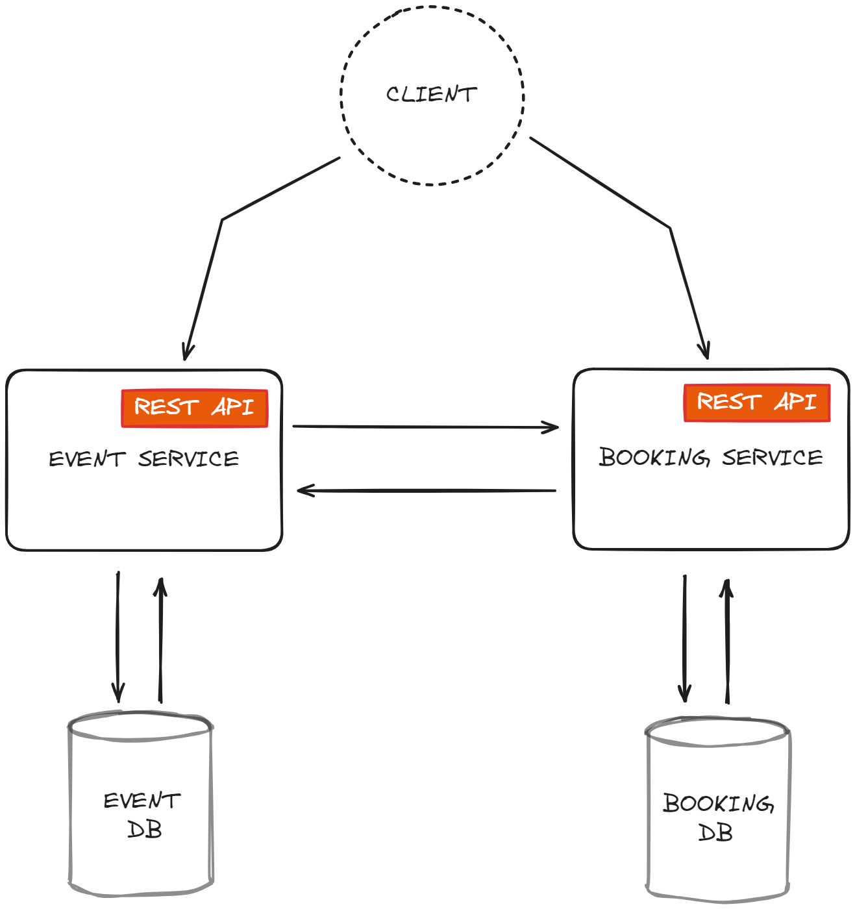

# Java microservices booking app
The is a simple booking app built to demonstrate the [Microservice architecture](https://martinfowler.com/microservices/) using the Spring Boot, Spring Cloud and Docker. The project is intended as a tutorial. 

## Functionnal services 
The app is decomposed into two core microservices. There are independently deployable applications organizaed around a certain business domains.

### Event service
Exposes endpoints to handle events CRUD.

Method	| Path	| Description	| User authenticated	| 
------------- | ------------------------- | ------------- |:-------------:|
GET	| /events	| Get all the events	|  | 	
GET	| /events/{id}	| Get a specific event	| × | ×
POST	| /events	| Create a new event	|   | 	×
PUT	| /events/{id}	| Update a given event	| × | ×
DELETE	| /events/{id}	| Cancel a given event	| × | ×

### Booking service
Exposes endpoints to book an event (buy tickets) and displayed booking informations.

Method	| Path	| Description	| User authenticated	| 
------------- | ------------------------- | ------------- |:-------------:|
GET	| /booking	| Get all the ticket	|  | 	
GET	| /booking/{id}	| Get a specific booking	| × | ×
POST	| /booking	| Buy tickets for an event	|   | 	×
PUT	| /booking/{id}	| Update a given booking	| × | ×
GET	| /booking/event/{id}	| Get all the ticket for a given event	| × | ×

### Notes
- Each microservice has its own database, so there is no way to bypass API and access persistence data directly.
- [PostgreSQL](https://www.postgresql.org/) is used as a primary database for each of the services.
- All services are talking to each other via the Rest API

## Infrastructure 

[Spring cloud](https://spring.io/projects/spring-cloud) provides powerful tools for developers to quickly implement common distributed systems patterns

### API gateway 
API Gateway is a single entry point into the system, used to handle requests and routing them to the appropriate backend service. 

In this project we are using [Spring Cloud Gateway](https://spring.io/projects/spring-cloud-gateway). 

### Service discovery 
Service discovery simplifies the configuration and management of distributed systems by abstracting away the details of service locations. Each time a new server is run it registers itself to the registry.

The key part of Service discovery is the Registry. In this project, we use Netflix Eureka. Eureka is a good example of the client-side discovery pattern, where client is responsible for looking up the locations of available service instances and load balancing between them.

With Spring Boot, you can easily build Eureka Registry using the [spring-cloud-starter-eureka-server](https://cloud.spring.io/spring-cloud-netflix/reference/html/) dependency, @EnableEurekaServer annotation and simple configuration properties.

### Config service
[Spring Cloud Config](https://docs.spring.io/spring-cloud-config/docs/current/reference/html/) is horizontally scalable centralized configuration service for the distributed systems. It uses a pluggable repository layer that currently supports local storage, Git, and Subversion.

## Deployment 

## Usage 

## Frontend

The frontend part of this project is built using the lastest version of angular. Here is some screen shoots

### Events list

### Booking list

## Built by

- Marius Vincent NIEMET [Twitter](https://twitter.com/mariusniemet05) [LinkedIn](https://www.linkedin.com/in/marius-vincent-niemet-928b48182/) 
